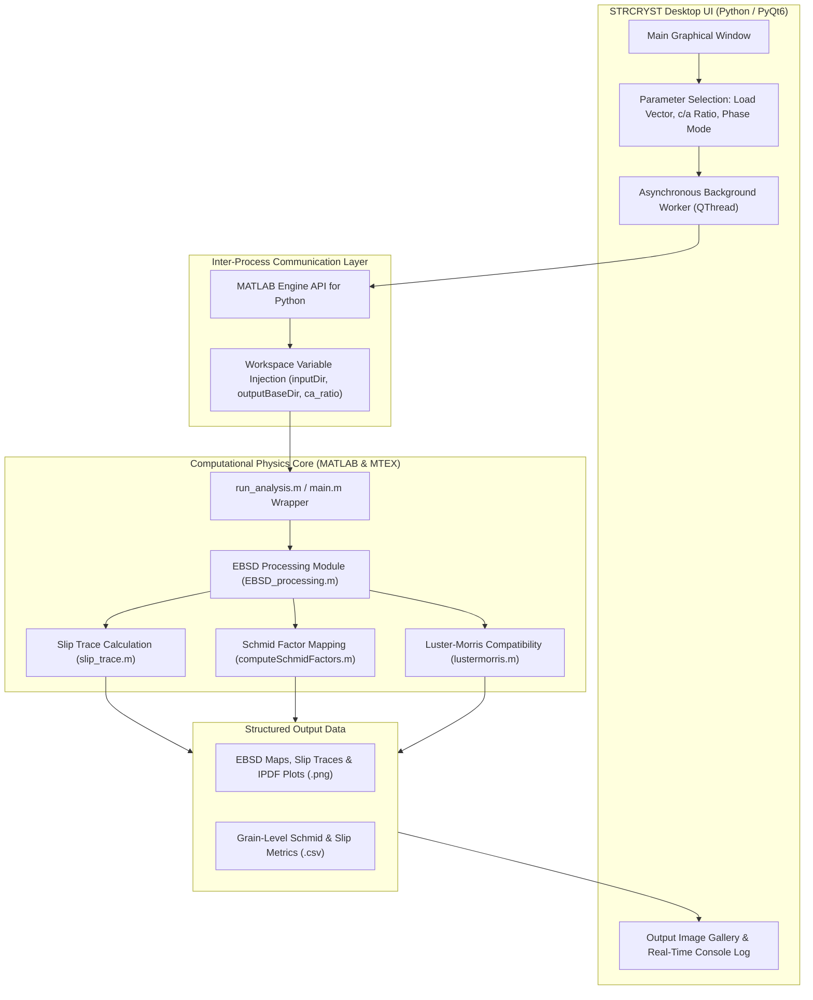
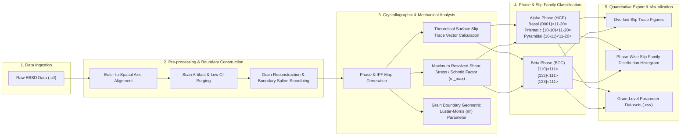

# MTEX Slip Trace Analysis & STRCRYST Application

An automated computational framework and desktop software application for crystallographic slip trace identification, Schmid factor mapping, and deformation compatibility analysis in dual-phase ($\alpha$-HCP / $\beta$-BCC) metallic alloys.


---

## Technology Stack

| Layer | Component / Technology | Badge |
| :--- | :--- | :--- |
| **Numerical Core** | MATLAB (R2021a+) |  |
| **Crystallography Engine** | MTEX Toolbox |  |
| **Desktop Application** | Python 3.9+ |  |
| **User Interface Framework** | PyQt6 |  |
| **Inter-Process Integration** | MATLAB Engine API for Python |  |
| **Executable Packaging** | PyInstaller |  |

---

## Overview

The **MTEX Slip Trace Analysis** framework provides an integrated pipeline for microstructural and crystallographic deformation analysis using Electron Backscatter Diffraction (EBSD) data. By combining raw EBSD data import, automatic spatial alignment, grain boundary identification, theoretical slip trace modeling, and Schmid factor calculations, this tool allows researchers to evaluate active slip systems and local deformation compatibility across individual grains and phase boundaries.

The repository includes both modular **MATLAB scripts** utilizing the MTEX toolbox and **STRCRYST**, a modern desktop interface built with Python and PyQt6 that interfaces directly with the MATLAB Engine API.

---

## Overview of Key Features

### Core EBSD Engine & Crystallographic Analysis
* **Automated Data Processing:** Automatic Euler-to-spatial alignment, scanning artifact purging, grain boundary determination, and spline smoothing for high-precision boundary mapping.
* **Theoretical Slip Trace Overlay:** Direct calculation and visual overlay of theoretical slip trace lines on Inverse Pole Figure (IPF) maps for HCP and BCC slip families.
* **Schmid Factor Mapping:** High-throughput calculation of maximum resolved shear stress (Schmid factors) for user-selected loading directions (X, Y, or Z).
* **Deformation Compatibility ($m'$ Parameter):** Boundary-by-boundary calculation and spatial mapping of the geometric Luster-Morris deformation compatibility parameter across grain interfaces.
* **Statistical Data Export:** Automated extraction of grain-level crystallographic properties and aggregated slip system distribution statistics exported directly to CSV and high-resolution figures.

### STRCRYST Desktop Application (v1.0 UI)
* **Graphical Control Interface:** Full visual management of input datasets, output directories, loading vectors, axial ratios, and crystal system configurations.
* **Asynchronous Execution:** Threaded background computation preventing UI freezing during heavy MATLAB numerical operations.
* **Built-in Output Inspection:** Thumbnail grid viewer and full-resolution image inspection window for generated EBSD maps and statistical plots.

---

## System Architecture & Data Flow

### 1. Overall System Architecture & Desktop Inter-Process Communication



### 2. Scientific Crystallographic Workflow Pipeline



---

## Release Notes

### Version 1.0.0
* **Graphical User Interface Introduced:** Developed the STRCRYST desktop application using PyQt6 for streamlined workflow setup and control without requiring direct script editing.
* **Asynchronous MATLAB Engine Integration:** Integrated Python-MATLAB Engine API execution within background QThread workers, ensuring smooth UI performance during compute-intensive tasks.
* **Interactive Output Gallery:** Added interactive image previewing and thumbnail generation for generated EBSD maps, slip trace figures, and IPDF key plots.
* **Dynamic Parameter Configuration:** Enabled runtime selection for loading direction (X, Y, Z), custom axial ratio ($c/a$), and crystal phase modes (Dual-phase HCP+BCC, HCP-only, or BCC-only).
* **Batch Processing & Export:** Automated complete batch pipeline runs across multi-file EBSD datasets with structured directory management.

---

## Prerequisites

To run the analysis scripts and the STRCRYST desktop application, ensure the following software components are installed:

1. **MATLAB** (R2021a or later)
   * MathWorks MATLAB environment.
2. **MTEX Toolbox**
   * Download and install from [mtex-toolbox.github.io](https://mtex-toolbox.github.io/).
   * Initialize in MATLAB by running `startup_mtex` prior to first run.
3. **Python** (Version 3.9 or later)
   * Python runtime for executing the STRCRYST application wrapper.
4. **PyQt6**
   * Install via pip:
     ```bash
     pip install PyQt6
     ```
5. **MATLAB Engine API for Python**
   * Installed manually from your local MATLAB directory.
   * On Windows (Run Command Prompt as Administrator):
     ```cmd
     cd "C:\Program Files\MATLAB\R2023b\extern\engines\python"
     python setup.py install
     ```
   * On Linux / macOS:
     ```bash
     cd /usr/local/MATLAB/R2023b/extern/engines/python
     python setup.py install
     ```

---

## Repository Structure

```
MTEX-Slip-Trace-Analysis/
├── main.m                            # Primary MATLAB execution script
├── EBSD_processing.m                 # EBSD import, filtering, and grain reconstruction
├── slip_trace.m                      # Theoretical slip trace calculation module
├── activated_slips.m                 # Identification of active slip system families
├── computeSchmidFactors.m            # Schmid factor tensor calculation
├── lustermorris.m                    # Luster-Morris (m') compatibility analysis
├── slip_systems.m                    # Definition of HCP and BCC slip system geometries
├── slipsystemdist.m                  # Statistical distribution compilation
├── match_slip_label.m                # Indexing helper (3-index BCC / 4-index HCP)
├── angle_with_horizontal.m           # Geometric orientation helper functions
├── cosTheta.m                        # Vector angular metric calculator
├── modifyctf.m                       # CTF data format normalization helper
├── EBSD_crystal_orientation_image.m  # Orientation map rendering helper
└── STARTCRYST SOFTWARE v1.0/         # Desktop UI application files
    └── Software Files/
        └── STRCRYST/                 # Python PyQt6 GUI application codebase
            ├── main.py               # Main entry point for the desktop GUI
            ├── run_analysis.m        # MATLAB wrapper script for UI injection
            ├── ui/                   # Desktop UI components and layout widgets
            ├── core/                 # Background process worker management
            └── STRCRYST.spec         # PyInstaller packaging configuration
```

---

## Usage Guide

### Method 1: Running the Standalone Executable (`STRCRYST.exe`)

For end-users who prefer a direct desktop app experience without manually managing Python dependencies:

1. Navigate to the distributed executable directory:
   ```cmd
   cd "STARTCRYST SOFTWARE v1.0/Software Files/STRCRYST/dist/STRCRYST"
   ```
2. Double-click or launch `STRCRYST.exe` from the command line:
   ```cmd
   STRCRYST.exe
   ```
3. In the STRCRYST application interface:
   * Select the **Scripts Folder** containing your `.m` script files.
   * Select the **Input Folder** containing `.ctf` format EBSD files.
   * Select the **Output Folder** for saving figures and CSV data.
   * Configure **Loading Direction**, **c/a Ratio** (e.g., 1.5930 for Zr), and **Crystal System Mode**.
   * Click **Run Analysis**.
4. Monitor progress in the real-time console log and inspect output maps in the built-in image gallery.

#### Packaging `STRCRYST.exe` from Source
If you modify the Python UI source code and wish to recompile the standalone `.exe` binary:
```bash
cd "STARTCRYST SOFTWARE v1.0/Software Files/STRCRYST"
pip install pyinstaller
pyinstaller STRCRYST.spec
```
The compiled executable package will be created in `dist/STRCRYST/`.

---

### Method 2: Running via Python (`main.py`)

1. Open a terminal or command prompt and navigate to the application directory:
   ```bash
   cd "STARTCRYST SOFTWARE v1.0/Software Files/STRCRYST"
   ```
2. Launch the application:
   ```bash
   python main.py
   ```
3. Follow the interface instructions to configure folders and parameters before clicking **Run Analysis**.

---

### Method 3: Running Directly in MATLAB

1. Open MATLAB and ensure the MTEX toolbox is loaded (`startup_mtex`).
2. Add the repository directory to your MATLAB path.
3. Open `main.m` and configure your dataset paths:
   ```matlab
   inputDir  = 'C:\Path\To\Input_CTF_Files';
   outputBaseDir = 'C:\Path\To\Output_Directory';
   ```
4. Run `main.m` to execute the full pipeline.

---

## Output Data & Visualizations

For each processed input file, the pipeline generates structured outputs:

| Output File Name | Description |
| :--- | :--- |
| `<sample>_EBSD_Map.png` | Phase distribution and inverse pole figure microstructural map |
| `<sample>_Alpha_SlipTraces.png` | Experimental vs. theoretical slip trace overlay for Alpha (HCP) phase |
| `<sample>_Beta_SlipTraces.png` | Experimental vs. theoretical slip trace overlay for Beta (BCC) phase |
| `<sample>_Alpha_GrainID_Map.png` | Grain identification map with labeled indices for Alpha phase |
| `<sample>_Beta_GrainID_Map.png` | Grain identification map with labeled indices for Beta phase |
| `<sample>_Alpha_IPDF.png` | Inverse pole figure density distribution plot for Alpha phase |
| `<sample>_Beta_IPDF.png` | Inverse pole figure density distribution plot for Beta phase |
| `<sample>_Alpha_Grain_Slip_Data.csv` | Grain-by-grain Schmid factors and slip system metrics (Alpha) |
| `<sample>_Beta_Grain_Slip_Data.csv` | Grain-by-grain Schmid factors and slip system metrics (Beta) |
| `Combined_SlipSystem_vs_Grains_AlphaBeta.png` | Aggregated statistical distribution chart across all processed grains |

---

## Authors & Credits

* **Core Algorithms & Numerical Implementation:** Dhiraj Kori
* **User Interface & Application Architecture:** Parardha Dhar

---

## License

This project is licensed under the MIT License - see the [LICENSE](LICENSE) file for details.
